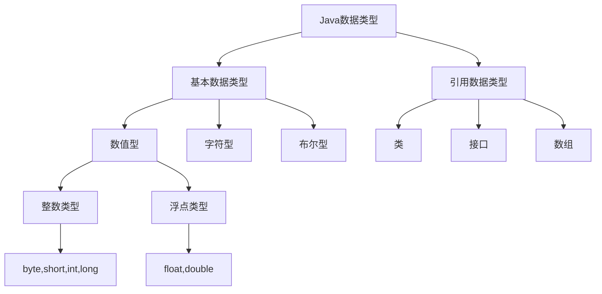

## 一、数据类型概述

在 `Java` 中，数据类型分为两大类：

1. **基本数据类型（Primitive Types）**
2. **引用数据类型（Reference Types）**



## 二、基本数据类型

### 1. 整数类型

| 类型  | 大小 | 范围 | 默认值 | 示例 |
|-------|------|------|--------|------|
| `byte` | 8位 | -128 ~ 127 | 0 | `byte b = 100;` |
| `short` | 16位 | -32768 ~ 32767 | 0 | `short s = 1000;` |
| `int` | 32位 | -2^31 ~ 2^31-1 | 0 | `int i = 100000;` |
| `long` | 64位 | -2^63 ~ 2^63-1 | 0L | `long l = 10000000000L;` |

### 2. 浮点类型

| 类型 | 大小 | 范围 | 默认值 | 示例 |
|------|------|------|--------|------|
| `float` | 32位 | 约 ±3.4E+38 | 0.0f | `float f = 3.14f;` |
| `double` | 64位 | 约 ±1.7E+308 | 0.0d | `double d = 3.1415926;` |

### 3. 字符类型

| 类型 | 大小 | 范围 | 默认值 | 示例 |
|------|------|------|--------|------|
| `char` | 16位 | 0 ~ 65535 | '\u0000' | `char c = 'A';` |

### 4. 布尔类型

| 类型 | 大小 | 范围 | 默认值 | 示例 |
|------|------|------|--------|------|
| `boolean` | 1位 | true/false | false | `boolean flag = true;` |

## 三、引用数据类型

### 1. 类（Class）

```java
// 示例：自定义类
public class Person {
    private String name;
    private int age;
    
    public Person(String name, int age) {
        this.name = name;
        this.age = age;
    }
    
    // getter和setter方法
}
```

### 2. 字符串（String）

`String` 是 Java 中最常用的引用类型之一，用于表示文本字符串。虽然它看起来像基本类型，但实际上是一个类。

#### 2.1 String 的特点

1. **不可变性**
   - `String` 对象一旦创建就不能被修改
   - 所有看似修改字符串的操作都会创建新的 `String` 对象

2. **字符串池（String Pool）**
   - Java 使用字符串池来优化字符串存储
   - 相同的字符串字面量会共享同一个对象

```java
// 示例：String 创建方式
String str1 = "Hello";  // 使用字符串字面量
String str2 = new String("Hello");  // 使用构造函数
String str3 = str1 + " World";  // 字符串拼接
```

#### 2.2 String 常用方法

```java
// 示例：String 常用方法
String str = "Hello World";

// 获取长度
int length = str.length();  // 11

// 获取子字符串
String sub = str.substring(0, 5);  // "Hello"

// 查找字符
int index = str.indexOf('o');  // 4

// 字符串比较
boolean equals = str.equals("Hello World");  // true
boolean ignoreCase = str.equalsIgnoreCase("hello world");  // true

// 字符串转换
String upper = str.toUpperCase();  // "HELLO WORLD"
String lower = str.toLowerCase();  // "hello world"

// 去除空格
String trim = "  Hello  ".trim();  // "Hello"
```

#### 2.3 StringBuilder 和 StringBuffer

由于 `String` 的不可变性，频繁的字符串操作会产生大量临时对象。这时可以使用 `StringBuilder` 或 `StringBuffer`：

```java
// 示例：StringBuilder 使用
StringBuilder sb = new StringBuilder();
sb.append("Hello");
sb.append(" ");
sb.append("World");
String result = sb.toString();  // "Hello World"

// StringBuffer 使用方式相同，但线程安全
StringBuffer sbf = new StringBuffer();
sbf.append("Hello");
sbf.append(" ");
sbf.append("World");
String result2 = sbf.toString();  // "Hello World"
```

#### 2.4 String 与 char[] 的转换

```java
// String 转 char[]
String str = "Hello";
char[] chars = str.toCharArray();

// char[] 转 String
char[] chars2 = {'H', 'e', 'l', 'l', 'o'};
String str2 = new String(chars2);
```

### 3. 接口（Interface）

```java
// 示例：接口定义
public interface Animal {
    void eat();
    void sleep();
}
```

### 4. 数组（Array）

```java
// 示例：数组声明和初始化
int[] numbers = new int[5];  // 声明长度为5的整型数组
String[] names = {"Alice", "Bob", "Charlie"};  // 声明并初始化字符串数组
```

## 四、类型转换

### 1. 自动类型转换（隐式转换）

```java
// 示例：自动类型转换
int i = 100;
long l = i;  // 自动将int转换为long
float f = l; // 自动将long转换为float
```

### 2. 强制类型转换（显式转换）

```java
// 示例：强制类型转换
double d = 3.14;
int i = (int)d;  // 强制将double转换为int，结果为3
```

### 3. 类型转换规则

1. 小类型转大类型：自动转换
   - `byte` → `short` → `int` → `long` → `float` → `double`
   - `char` → `int` → `long` → `float` → `double`

2. 大类型转小类型：需要强制转换
   - 可能造成精度损失
   - 可能造成数据溢出

## 五、包装类（Wrapper Classes）

| 基本类型 | 包装类 |
|----------|--------|
| `byte` | `Byte` |
| `short` | `Short` |
| `int` | `Integer` |
| `long` | `Long` |
| `float` | `Float` |
| `double` | `Double` |
| `char` | `Character` |
| `boolean` | `Boolean` |

### 自动装箱和拆箱

```java
// 自动装箱: Java自动将基本数据类型 int 的值 100 转换为对应的包装类 Integer 对象。
Integer i = 100;

// 自动拆箱: Java自动将 Integer 对象 i 转换为基本数据类型 int。
int j = i;
```

:::tip
- **自动装箱**：像把一件商品（基本类型）自动放进盒子（包装类对象）里。

- **自动拆箱**：自动拆箱：像从盒子里直接取出商品，丢掉盒子。
:::

## 六、特殊值

### 1. 空值（null）

- 只能赋值给引用类型
- 不能赋值给基本类型

### 2. 默认值

- 基本类型：0或false
- 引用类型：null

## 七、注意事项

1. 选择合适的数据类型
   - 考虑数据范围
   - 考虑内存占用
   - 考虑性能影响

2. 类型转换注意事项
   - 避免不必要的类型转换
   - 注意精度损失
   - 注意数据溢出

3. 包装类使用建议
   - 优先使用基本类型
   - 需要对象特性时使用包装类
   - 注意自动装箱拆箱的性能影响

