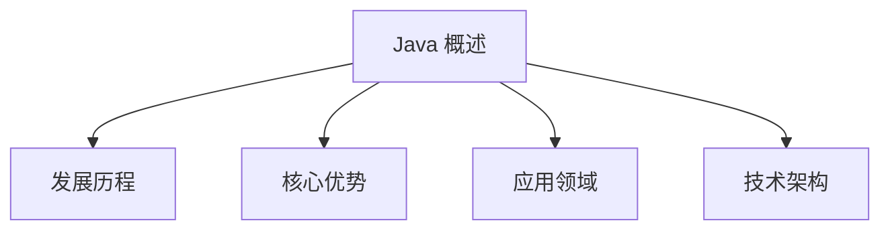

## 一、Java 概述

`Java` 作为一门经久不衰的编程语言，在软件开发领域占据着重要地位。让我们从以下几个维度来认识这门语言：

## 二、Java 发展历程

`Java` 的诞生源于一个富有远见的构想。1990年代初，`Sun` 公司的技术团队在詹姆斯·高斯林的带领下，开始研发一种面向智能家电的编程语言，最初命名为 `Oka`。虽然这个项目最初并未获得市场认可，但互联网的兴起为这门语言带来了新的机遇。

1995年，经过改造后的 `Oka` 以 `Java` 之名正式发布，开启了它的传奇之旅。2009年，`Oracle` 收购 `Sun` 公司，`Java` 成为 `Oracle` 的重要产品线。

`Java` 的发展历程见证了编程语言的进化：

| 版本 | 发布时间 | 里程碑特性 |
|------|----------|------------|
| `JDK 1.0` | 1996年 | 奠定 `JVM` 基础架构 |
| `J2SE 1.2` | 1998年 | 确立三大平台架构 |
| `Java SE 5.0` | 2004年 | 引入泛型、枚举等现代特性 |
| `Java SE 8` | 2014年 | 函数式编程支持 |
| `Java SE 11` | 2018年 | 模块化系统完善 |
| `Java SE 17` | 2021年 | 最新 `LTS` 版本 |

## 三、Java 的核心优势

1. **跨平台能力**
   - 基于 `JVM` 的"一次编写，到处运行"特性
   - 强大的可移植性，支持多种操作系统

2. **丰富的生态系统**
   - 庞大的开发者社区
   - 完善的第三方库支持
   - 丰富的开发工具链

3. **企业级特性**
   - 强大的并发处理能力
   - 完善的安全机制
   - 稳定的性能表现

## 四、Java 应用领域

`Java` 的应用场景极其广泛：

1. **企业级应用**
   - 金融系统
   - 电子商务平台
   - 企业资源规划系统

2. **移动开发**
   - `Android` 应用开发
   - 企业移动解决方案

3. **大数据与云计算**
   - `Hadoop` 生态系统
   - 分布式系统开发

4. **Web 开发**
   - 后端服务开发
   - 微服务架构

## 五、Java 技术架构

`Java` 技术体系包含三个核心组件：

1. **Java 语言规范**
   - 语法规则
   - 编程范式
   - 最佳实践

2. **Java 虚拟机 (`JVM`)**
   - 字节码执行
   - 内存管理
   - 性能优化

3. **Java 类库**
   - 标准库
   - 扩展库
   - 第三方库

`Java` 平台分为三个主要版本：

- **Java SE**: 标准版，面向桌面应用（**核心学习版本**）
- **Java EE**: 企业版，面向大型系统（**已被 `Spring Boot` 取代**）
- **Java ME**: 微型版，面向移动设备（**已被 `Kotlin` 取代**）

jar包以及maven
模块化（java8 java9）
输入输出 譬如文件操作、读取以及控制台
数据库连接
lombok
开源库（fastjson）
