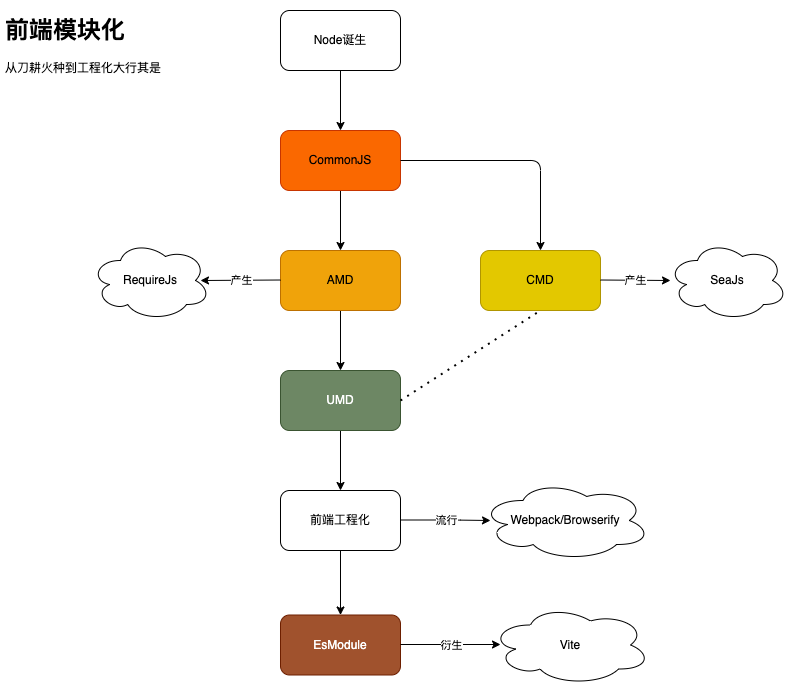

前端模块化的作用有两个：

1. 不污染全局变量。
2. 更好的组织和维护代码模块之间的关系。

由于 `JavaScript` 刚开始时，都是利用 `var` 语法声明变量。

而 `var` 声明的属性则有可能污染全局变量 `window`（函数作用域内的 `var` 除外）。

由此，解决办法就是 `IIFE`（**立即执行函数**）。

另外，在前端工程化概念未普及的时代，我们在开发时，通常是利用 `<script>` 标签来引入 `JavaScript`。

但这样做有两个弊端：

1. 需要严格控制 `script` 的引用顺序。
2. `<script>` 默认同步加载，不利于页面渲染。

在这种情况下，衍生出了许多模块化标准：

- `CommonJS`
- `AMD`
- `CMD`
- `UMD`
- `EsModule`

在谈论具体的模块化规范之前，我们先梳理下**模块化规范的历史**。

前端模块化的诞生，最早要追溯到 `Node` 的出现。

1. `Node` 的模块化规范刚开始命名为 `ServerJS`，后来社区想要根据 `ServerJS` 一统浏览器端和服务端的模块规范，更名为了 `CommonJS`。

2. 但在这段进展中，有人觉得浏览器端有其本身的特性，应该据此设计新的模块规范 `AMD`，这一规范的标准产物是 `RequireJS`。

3. 而后第三方库里，为了兼容 `CommonJS` 和 `AMD` 这两种规范，使用了 `UMD`。

4. 还有一部分同学，觉得应该讲浏览器端的特性及 `CommonJS` 规范相结合，从而有了 `CMD` 规范，这一规范的标准产物是 `SeaJS`。

5. 但 `CMD` 的推广做的并不好，所以导致在实际应用和社区支持上远远比不上 `AMD` 和 `CommonJS`。

6. 而后，打包工具大行其是，前端工程化开始流行。即模块引用在开发时做好，构建过程中分析依赖，注入生产。标准产物是 `webpack` 和 `browserify`。

7. 如今，在 `Es6` 中提供了新语法 `EsModule`，浏览器端也逐渐开始直接支持 `Module Script`。标准产物是 `Vite`。

参考文章：

- [前端模块化开发那点历史](https://github.com/seajs/seajs/issues/588)

- [JavaScript 模块化七日谈](http://huangxuan.me/js-module-7day/#/)
