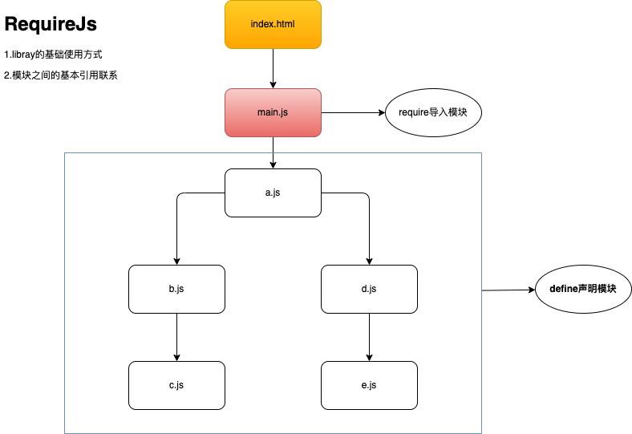
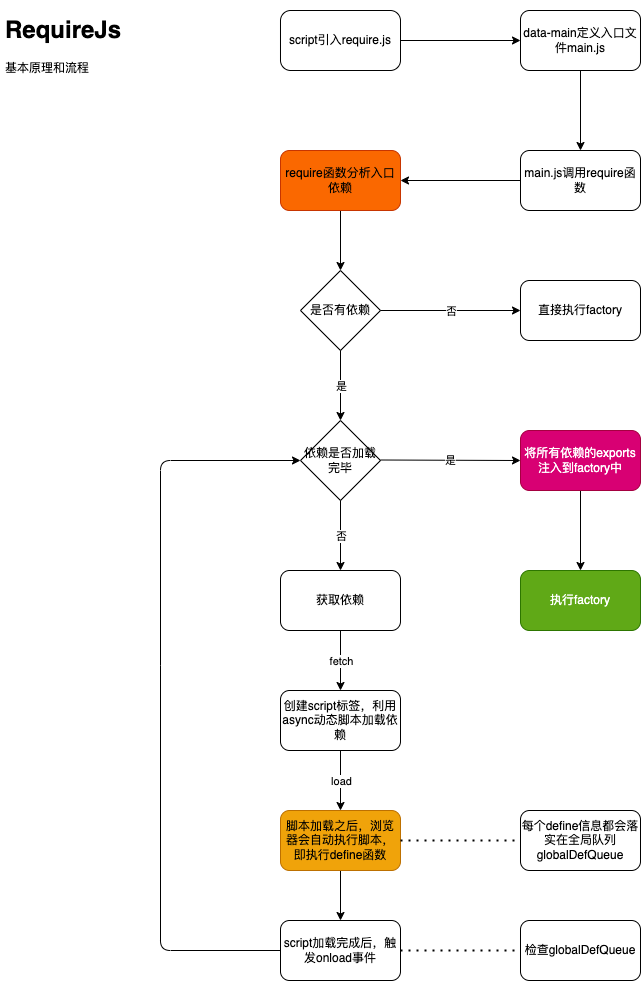

`AMD` 的全称是 `Asynchronous Module Definition`。即**异步模块定义**。

`AMD` 规范的具体实现是 `RequireJS`。

## 4-1.基本用法

**这里只声明基本用法形式**。

模板文件 `index.html`:

1. 利用 `script` 标签引入 `require.js`。
2. 声明 `data-main` 自定义属性定义**入口文件**。

```html
<script data-main="path/to/main.js" src="/path/to/require.js"></script>
```

入口文件 `main.js`:

```js
require(['/path/to/modules/a'], function (a) {
  console.log('main')
})
```

`a.js`:

```js
define(['/path/to/modules/b', '/path/to/modules/d'], function (b, d) {
	console.log('a')
  return 'a'
})
```

`b.js`:

```js
define(['/path/to/modules/c'], function (c) {
	console.log('b')
  return 'b'
})
```

`c.js`:

```js
define(function () {
	console.log('c')
  return 'c'
})
```

`d.js`:

```js
define(['/path/to/modules/e'], function () {
	console.log('d')
	return 'd'
})
```

`e.js`:

```js
define(function () {
	console.log('e')
	return 'e'
})
```

其引用关系如下图：



可以看出，`require.js` 的基本用法是：

1. 利用 `data-main` 属性声明入口文件。
2. 入口文件利用 `require` 导入依赖。
3. 模块使用 `define` 声明，而且相关依赖会提前在 `define` 中声明。

## 4-2.requireJs的基本原理



对于 `commonJS` 模块化规范来说，它是同步读取磁盘内的文件，很快，不会有延时，而且 `node` 能够读取、处理文件。

但对于浏览器端来说，`JS` 并不能直接读取操作文件。

那浏览器端的模块化具体是怎样实现的呢？（这个问题在之前，对我来讲，一直是疑问和困扰，百思不得其解。）

后来我明白了`AMD` 和 `CMD` 都是利用的动态脚本以及其对应的 `onload` 事件监听。

`AMD` 表示的是 `Asynchronous Module Definition`，其中的 `Asynchronous` 表示的就是 `<script>` 标签的 `async` 性质。

即异步加载，不阻塞 `DOM`。异步加载**所有依赖**后，再执行 `factory` 回调函数。

:::tip
要注意的两个特点：

1. `RequireJS` 的依赖需要提前声明好。
2. `RequireJS` 模块在加载完所有依赖后，会将各自的 `exports` 作为参数传入该模块对应的 `factory` 函数中，并立即执行该 `factory` 函数，也就是说每一个 `define` 的 `factory` 回调函数在执行时已经能够拿到其依赖项目的 `exports` 导出。

这两点也是 `AMD` 与 `CMD` 的差异，下一节在 `CMD` 中会详述。
:::

`RequireJS` 源码晦涩冗余，比较难以梳理其逻辑关系。

这里推荐一个简化版的 [RequireJS Analysis](https://github.com/ZhiCYue/requireJs-analysis)。

## 4-3.r.js

我们已经知道 `require.js` 是利用动态脚本加载依赖。

那么显而易见的一个问题是：

当项目越来越大，依赖越来越多，会发起越来越多的 `http` 请求以加载依赖。

这对于项目性能，无疑是一种巨大的损耗。

出于这种角度的考虑，`requireJs` 团队他们提供了 [r.js](https://github.com/requirejs/r.js)。

该工具会将依赖打包以减少 `http` 请求。

:::tip
我们可以在生产环境下，利用该工具进行处置依赖，从而提升生产环境的项目性能。
:::
