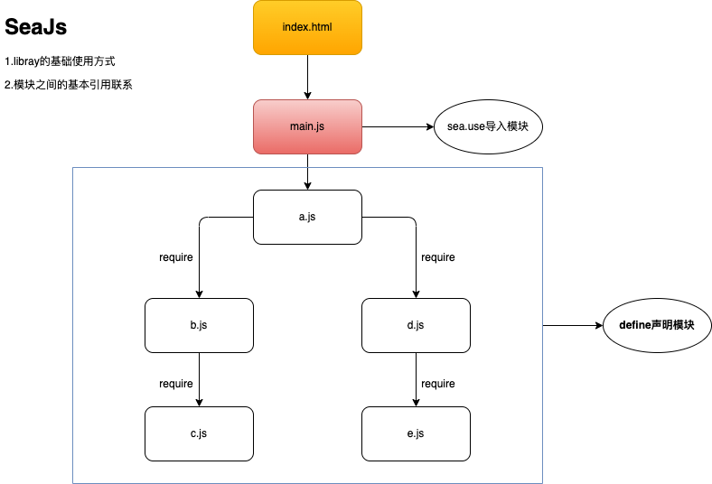
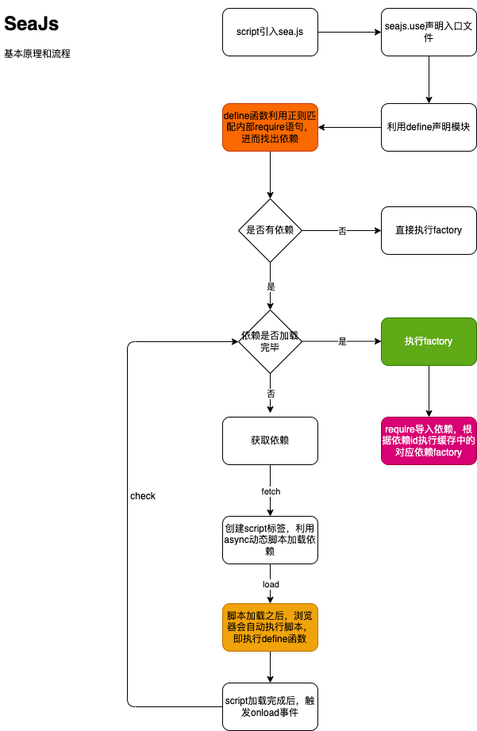

`CMD` 的全称是 `Common Module Definition`。直译的话就是**公共模块定义**。

`CMD` 规范的具体实现是 `SeaJS`。

## 5-1.基本用法

**这里只声明基本用法形式**。

模板文件 `index.html`:

1. 利用 `script` 标签引入 `sea.js`。
2. 利用 `seajs.use` 自定义属性定义**入口文件**。

```html
<script src="/path/to/sea.js"></script>
<script>
  // seajs 的简单配置
  seajs.config({
    base: './js'
  })
  // 加载入口模块
  seajs.use('./js/main')
</script>
```

入口文件 `main.js`:

```js
define(function (require, exports, module) {
	var a = require('a')
	console.log('main')
})
```

`a.js`:

```js
define(function (require, exports, module) {
	var b = require('b')
	var d = require('d')
	console.log('a')
	return 'a'
})
```

`b.js`:

```js
define(function (require, exports, module) {
	var c = require('c')
	console.log('b')
	return 'b'
})
```

`c.js`:

```js
define(function (require, exports, module) {
	console.log('c')
})
```

`d.js`:

```js
define(function (require, exports, module) {
	var e = require('e')
	console.log('d')
	return 'd'
})
```

`e.js`: 

```js
define(function (require, exports, module) {
	console.log('e')
	return 'e'
})
```
其引用关系如下图：



可以看出，`sea.js` 相对 `require.js` 在用法上有了一些差别：

1. 利用 `seajs.use` 声明入口文件。
2. 入口文件使用 `define` 声明，使用 `require` 导入依赖。
3. 模块依然使用 `define` 声明，但相关依赖不会再提前在 `define` 中声明，而是需要 `require` 函数进行导入。

:::tip
可以看出，`CMD` 在开发方式上与 `CommonJS` 有点类似。

因为 `CMD` 是 `CommonJS` 规范结合浏览器特性下的一种规范。
:::

## 5-2.seaJs的基本原理



:::tip
利用 `fuction.toString` 将 `factory` 函数转化为字符串，再利用正则筛选出依赖，这种方式算是 `CMD` 的一处诟病。

但在当时的环境下，`CMD` 的思想依然值得肯定。
:::

## 5-3.AMD与CMD的差异

在此之前，我要说明一下，在我刚接触 `JavaScript` 时，我个人的一种**主观错误认知**：

`AMD` 是异步模块，而 `CMD` 是同步模块。❎

**这种认知是严重错误的**。

无论是 `AMD` 还是 `CMD`，都是浏览器端的模块化规范，而浏览器端必不会同步引入模块（会导致延迟、阻塞等等...）。

`AMD` 与 `CMD` 都利用了 `async` 动态脚本的特性。

它们的相同之处在于**加载无顺序，执行有顺序**。

它们的不同之处有两点：

1. 依赖模块的声明方式——进而导致分析依赖的方式不同。
2. 依赖模块的执行时机——`AMD` 会提前**执行**依赖，将导出注入 `factory` 中。而 `CMD` 则在 `require` 时才会**执行**依赖。

最后，用比较官方的话来总结:

1. **`AMD` 依赖前置，`CMD` 依赖就近**。
2. **`AMD` 提前执行依赖，`CMD` 延迟执行依赖**。

