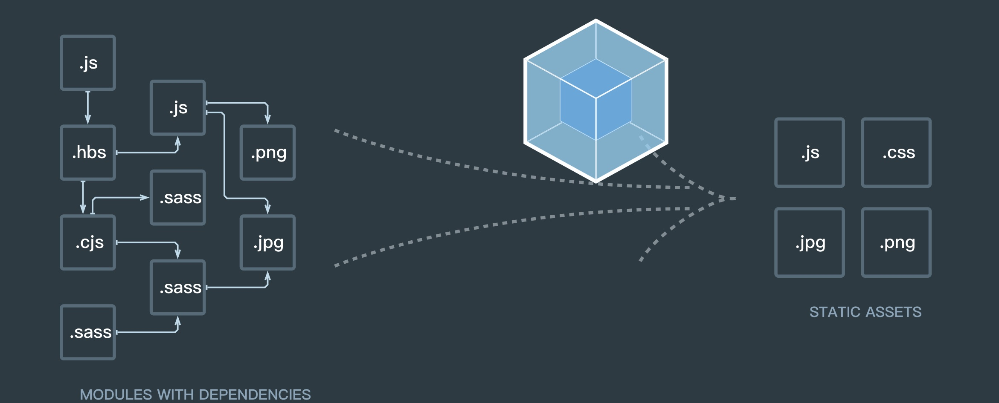

## 为什么要用webpack

`webpack`是前端工程化发展到一定阶段的必然产物。

`webpack`的基础是前端的模块化。它提供了对于`commonJs`、`AMD`以及`ES6 import`语法的支持。

## webpack如何使用



官网上的这幅图很形象。`webpack`会以某文件为入口，依次深层遍历该文件的依赖，将所有的依赖代码打包成一个文件。

值得一提的是，`webpack`不仅支持**SPA单页面应用**，它也能用在多页应用。

不考虑**异步Chunk以及公共Chunk**的话，单页面应用的`js`、`css`、`img`等最终都会打包成一个`JS`文件。而多页应用则会打包成多个。

## 学习webpack

`webpack`基础可以分为六部分：
- `entry`: 配置入口文件。
- `output`: 配置输出。
- `resolve`: 配置寻找模块的规则。
- `module`: 配置处理模块的规则。
- `plugins`: 配置扩展插件，拓展工作流功能。
- `devServer`: 配置开发环境，使开发环境效率更高。

## 安装webpack4.0

不推荐全局安装`webpack`。防止不同项目的依赖版本不同。另外如果想要使用`webpack`命令行的话，需要安装`webpack-cli`脚手架。目前`webpack`的最新版本是`4.0`。所以下面的`webpack`相关loader和插件用法等都是基于`4.0`来说的。

```shell
yarn add webpack webpack-cli
```

## 使用webpack4.0

安装完`webpack`及`webpack-cli`后，使用`webpack`命令行有3种常见用法。假设配置文件是`webpack.config.js`。

### 1.终端webpack命令行

如果想要在终端直接执行`webpack --config webpack.config.js`是不行的。假设当前命令行执行目录与`node_modules`同级，可以执行`./node_modules/.bin/webpack --config webpack.config.js`。

`--config`指令用来自定义`webpack`的配置文件。

### 2.npx

可能你觉得第一种方式不够优雅。`npm`自带了一个执行工具`npx`。于是可以使用：`npx webpack --config webpack.config.js`。

### 3.npm scripts

这种也是最常见也是最推荐的用法。

```json
{
  "scripts": {
    "build": "webpack --config webpack.config.js"
  }
}
```

这样就可以在终端中执行`npm run build`或者`yarn build`。
